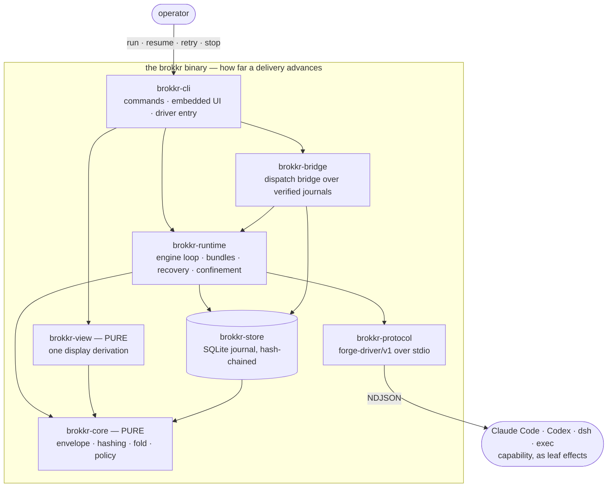
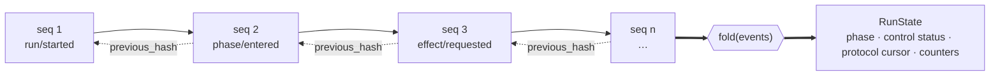
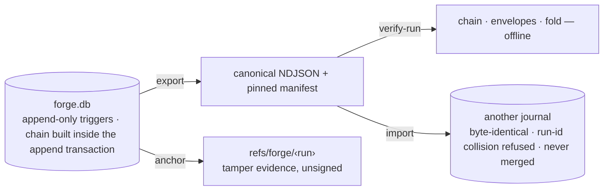
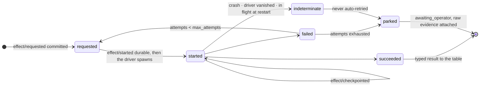
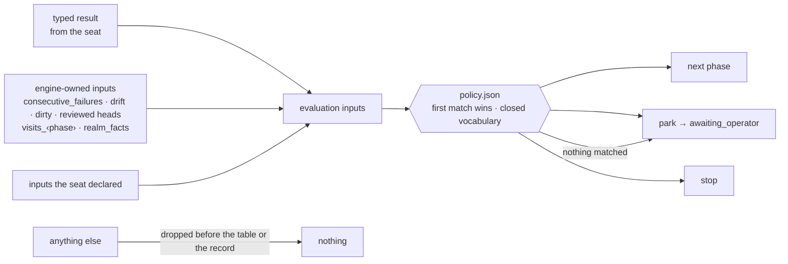
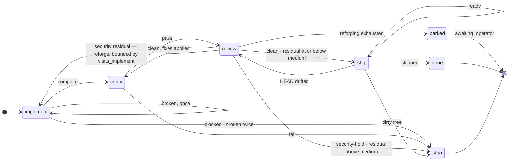
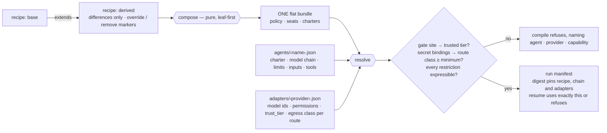
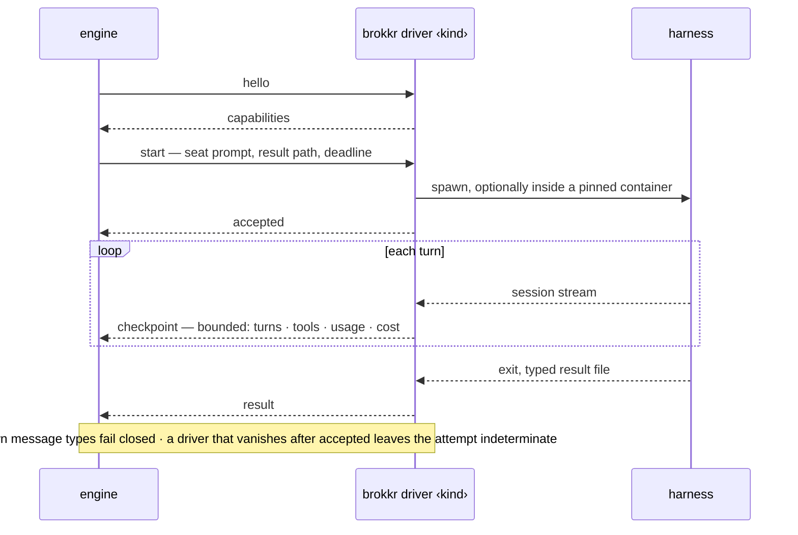

# Architecture

**Status**: the system as implemented. The blueprint it grew from is
[docs/target-architecture.md](docs/target-architecture.md); where this
page and a numbered [decision](docs/decisions/) disagree, the decision
wins.

Brokkr is a deterministic process manager wrapped around stochastic,
fallible effects. Agent sessions are leaves. Their outputs are typed
results. Only a pinned policy table ever selects a transition, and
every claim the system makes — done, verified, parked, stopped, paid —
is a journaled fact that replays byte for byte.

## The shape



Every edge drawn is a real dependency and every crate is drawn; the
edges a path already implies are left out (decision 0037).

Trust separates the crates, not deployment. `brokkr-core` performs no
I/O, clock reads, randomness or process execution: given the same
journal and bundle it returns the same state and the same ruling.
Everything effectful sits above it and is journaled around it.
`brokkr-view` is pure for a different reason: it is the one answer to
every display question, rendered by `ui.html` as pixels and by
`render.rs` as text, so the two surfaces cannot drift. Its manifest
depends on exactly `brokkr-core`, `serde` and `serde_json`, which makes
that purity a compile error rather than a review convention
(decision 0013).

Brokkr decides how far a delivery advances and nothing else. What is
worth delivering is decided above it, who pays is settled beside it
from the journal's seat ids and cost checkpoints, and the harnesses
below supply capability and nothing else. Each layer refuses a specific
kind of lying, and none overrides another's law.

## The journal is the run



Every event is a hash-chained envelope
([contracts/event-envelope.v1.schema.json](contracts/event-envelope.v1.schema.json)):
`seq` contiguous from 1, `previous_hash` chaining, `event_hash` over the
canonical bytes, `causation_id` naming the event that caused it. The
fold derives everything, and an event impossible at the current cursor
fails it closed: a journal that violates the protocol is corrupt, not
reinterpretable. Replay is byte-deterministic. Resume is replay.



A concurrent writer conflicts instead of forking history. Import
relocates one run; journals never merge (decision 0027). The anchor is
evidence, not proof: the ref is unsigned, and decision 0008 defers the
signing service.

## Every effect, in order



The order is the durable outbox: the request is committed before
execution, the start is durable before the driver spawns, checkpoints
land as they arrive, and each attempt ends in exactly one terminal
fact. A crash at any boundary recovers without losing a committed fact
and without turning an uncertain effect into a success. Seat input is a
pure function of the journal and the pinned bundle; recovery rebuilds
it and refuses to execute anything whose digest differs from what was
requested.

Autonomy is bounded (decision 0006). Determinate failures retry up to
`max_attempts`, deadline kills by the watchdog included. `indeterminate`
never retries, because a retry could duplicate or re-pay for finished
work. Exhaustion, schema violations, unmatched results and unknown
anything park the run with the raw evidence attached — never repaired,
coerced, or handed to a model to fix (decision 0001). Operator commands
are journal events, not prose.

## Policy is data



The strict core evaluates the table first-match-wins (decision 0004).
The condition vocabulary is closed and checked at load, so a misspelt
key refuses to load rather than silently never firing. An absent input
never satisfies a condition; an unreadable one parks. Provenance is
compile-time (decision 0007): engine-owned inputs overlay anything a
seat claims, declared inputs pass, everything else is dropped before it
reaches the table or the record.

The outer machine is a linear state machine by constitution (decision
0002): one active phase, a totally ordered journal. This is the `fast`
recipe's table, the one the front page runs:



`brokkr compile` rejects any table where the protected review phase can
be skipped on a path to a non-stop terminal. The way back is bounded in
the machine's own vocabulary (decision 0022): a rule may read
`visits_<phase>_gte`, the same count the graph renders as `×N`, and a
rule may rule a park instead of a phase. The seat a run returns to
receives the result that sent it back as `context.returned_from`.

The world is chosen at invocation (decision 0023): `realms.json` names
the repositories a run may see and the journal they share, is pinned by
content hash into the run manifest, and `resume` rehydrates it from that
pin rather than from the disk.

## A bundle, resolved



A bundle is reviewable text: policy, one seat per phase, pinned by
content digest. A seat is a single session or a **panel**: members fan
out inside one effect, join as a barrier in declared order, and a
closed-vocabulary aggregate produces the one typed result the machine
sees.

Composition (decision 0017) is a pre-pass over recipe sources that
resolves the chain into one flat bundle before anything is parsed: no
inheritance at run time, no dynamic lookup. Named things merge by name,
redefining needs the marker, removal fails if its target is absent, and
the constitutional lint runs on the resolved table.

Agents are defined once and adapters are data (decision 0016): no Rust
match arm over provider names is ever written, and a capability a
provider cannot express is declared as the explicit string
`"unsupported"`. Model policy is data with two compile-time refusals
behind it (decision 0021): every driver-bearing site declares a `class`
(`work` produces output the machine checks, `gate` is the check), every
adapter declares a `trust_tier`, and clearance to RECEIVE belongs to
the route, not the binary (decision 0036): an adapter declares an
egress class (`local`/`contracted`/`uncontracted`) for its own
destination and a `routes` map for the several one CLI may front, a
route being the prefix of a concrete model id, and a seat with secret
bindings compiles only if its resolved route meets the bundle's
`egress_minimum`. Both axes read closed on absence: an undeclared tier
is untrusted, an undeclared class is uncontracted, and a route the
adapter does not name inherits nothing — a ruling on one destination
clears no other the same binary reaches. Local is structural, not
earned: it says where an endpoint runs and confers no gate seat. Fallback along an agent's model chain is bounded to
`Failed` before `Accepted`, so a mid-session switch is unreachable by
construction. What allowed a site is pinned into the manifest, so
demoting a tier in `adapters/` moves the digest of every bundle standing
on it.

## Drivers



Drivers speak `forge-driver/v1`
([contracts/driver-protocol.v1.schema.json](contracts/driver-protocol.v1.schema.json)):
NDJSON over stdio, stdout protocol-only, stderr captured as an artifact.
The adapters for Claude Code, Codex, dsh and any
prompt-in/result-file-out harness are built into the binary as
`{brokkr} driver <kind>` (decision 0009), while the protocol stays
language-neutral for third-party drivers. Trust classes are data too:
`driver.confine {image, network, mounts}` wraps the command in a pinned
container with the workdir mounted at the same path.

## Verification, in layers

| Layer | What it pins |
|---|---|
| Differential corpus | A frozen 97-case corpus in [fixtures/](fixtures/) pins the evaluator: contract data, never regenerated. |
| Machine proof | End-to-end scenarios drive the real binary and real subprocess protocol through success, retries, stops, parks, crash recovery at every durable boundary, panels, confinement and bundle pinning. |
| Self-delivery | `bundles/self` lets the engine deliver changes to this repository; `shipped` is the sole entry into `done`, and the operator keeps push and merge. |
| Brokkr verification | `bundles/verify` examines an already-delivered change with a verify seat and a strictly read-only review seat. It has hard-stopped its own author's work on a real security finding. |

## The operating surface

```
brokkr init · doctor · compile · run · resume · operator · inspect · watch ·
       replay · export · import · verify-run · runs · costs · anchor ·
       ui · tui · muninn · driver
```

Exit codes: `0` completed · `2` parked (operator needed) · `3` stopped.
`brokkr ui`, `brokkr tui` and `brokkr inspect` are three renderers over
the same `brokkr-view` models (decision 0014): read-only, no operator
command, nothing written to the journal. `brokkr costs` reports per-seat
attempts, turns and USD from journal checkpoints, keyed by the stable
seat ids a cost ledger can join on.
