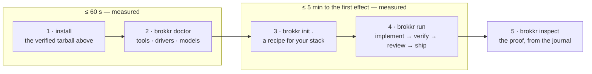

<p align="center"></p>

# Brokkr

[](https://github.com/feedback-loop-ai/brokkr/actions/workflows/ci.yml)
[](https://github.com/feedback-loop-ai/brokkr/releases/latest)
[](#license)
[](.github/workflows/ci.yml)
[](scripts/coverage-exact.sh)
[](deny.toml)
[](https://github.com/feedback-loop-ai/brokkr/releases/latest)
[](Cargo.toml)

**Coordination tools help agents work together. Brokkr proves what they did.**

Brokkr is a deterministic delivery engine for autonomous multi-agent software delivery: you give it a feature and a reviewable recipe, its agents implement, verify, review and ship, and its event-sourced phase machine records every result and ruling in a journal you can replay and audit.

## Install

Pick one channel. Each row is the channel's published command; the availability labels and the checksum-first release path are explained in the [quickstart](docs/guides/quickstart.md#step-1--install).

| Channel | One command | Availability |
|---|---|---|
| Release tarball (Linux x86_64) | `curl -LO https://github.com/feedback-loop-ai/brokkr/releases/latest/download/brokkr-linux-x86_64.tar.gz && curl -LO https://github.com/feedback-loop-ai/brokkr/releases/latest/download/SHA256SUMS && sha256sum --ignore-missing -c SHA256SUMS && tar xzf brokkr-linux-x86_64.tar.gz` | working today |
| cargo-binstall | `cargo binstall brokkr-cli` | live — the seven crates are on crates.io from v0.9.1, published by the release workflow at each tag |
| Nix | `nix profile install github:feedback-loop-ai/brokkr` | live from v0.9.0 — the release renders the flake digests and opens their pull request; nix reads the default branch |
| apt (repository configured) | `sudo apt-get install brokkr` | live from v0.9.0 — a signed repository on GitHub Pages; the one-time keyring and source lines are in [packaging/README.md](packaging/README.md) |
| dnf (repository configured) | `sudo dnf install brokkr` | live from v0.9.0 — same site, same signature; the repo file is in [packaging/README.md](packaging/README.md) |
| Homebrew | `brew install feedback-loop-ai/tap/brokkr` | live from v0.9.0 — the tap is bumped by the release and merged by the operator |
| Scoop | `scoop bucket add brokkr https://github.com/feedback-loop-ai/scoop-bucket && scoop install brokkr` | live from v0.9.0 — the bucket is bumped by the release and merged by the operator |

## 60-second bootstrap

Sixty seconds from a fresh machine to a lit run, then five minutes to the run's first completed effect. Both budgets are measured in CI by [`scripts/bootstrap-bench.sh`](scripts/bootstrap-bench.sh), which prints what it mocks. You need a git repository you are willing to let an agent edit and one agent CLI on `PATH` (`claude`, `codex` or `dsh`).



```console
brokkr doctor                       # ok / warn / MISSING per tool and driver; executes no agent
cd your-repo && brokkr init .       # writes bundle.json, policy.json, agents/, adapters/ — open them
brokkr run --bundle . --repo . --feature "add one visible improvement" && brokkr inspect --run latest
```

From a clone of this repository skip `init`: `brokkr run --recipe fast --repo . --feature "…"` resolves the library's own Rust recipe under `./recipes`. The run exits `0` at `done`, `2` when it parks for you, `3` when a rule stops it.

The inspection is derived from the journal; it shows the reviewer's verdict, the exact rule that accepted it and the phase graph. The sample is abridged: a real trail lists every event, and each finished seat carries its duration.

```text
run  add-one-visible-improvement-8bf6d692
     completed · phase done · seq 31
ruling  SHIP-COMPLETE  ship → done · shipped

seats
  participant status    attempts turns cost activity
  implement   succeeded 1        —     —    complete
  verify      succeeded 1        —     —    pass
  review      succeeded 1        —     —    clean
  ship        succeeded 1        —     —    shipped

trail
  22 transition/decided REVIEW-CLEAN-NO-FIXES review → ship · clean
  29 transition/decided SHIP-COMPLETE ship → done · shipped
  31 run/completed      completed

graph
  implement ×1 → verify ×1 → review ×1 → ship ×1 → done ×1  ←current
```

The [full quickstart](docs/guides/quickstart.md) covers `init` per stack, parks, the read surfaces and the evidence commands.

## Read next

- [Guides](docs/guides/README.md) — the task map: first run, recipes, agents, adapters, secrets, journals and repository anatomy.
- [Decision record](docs/decisions/README.md) — the constitution: every semantic rule, its status and its enforcement binding.
- [Essays](docs/essays/README.md) — the paradigm argued against the repository's own history and evidence.
- [Lore](docs/lore/README.md) — why Brokkr works the bellows, and why story is commentary rather than specification.
- [Evidence shelf](docs/evidence/README.md) — redacted journal exports that let the project's claims be inspected.
- [Contributing](CONTRIBUTING.md) — the mandatory sixty-second path from a fork to a pull request backed by a completed Brokkr run.
- [Architecture](ARCHITECTURE.md) — the implemented crates, journal, effect discipline and verification layers.

## Acknowledgments

The standing-overseer concept reached this product by way of the lieutenant in Robert C. Martin's [SwarmForge](https://github.com/unclebob/swarm-forge), as [decision 0019 ruling 7](docs/decisions/0019-brokkr.md#rulings) records. The idea is credited here and nothing else is taken: SwarmForge carries no license, which means all rights reserved, so no code, scripts, prompts or prose from it has entered — or may enter — this tree.

**Muninn** is an independent design with an inverted authority model, described in decision 0020 and built as `brokkr muninn`: it reads the journal, proposes to the operator, and rules nothing.

## License

Licensed under [Apache-2.0](LICENSE-APACHE) OR [MIT](LICENSE-MIT), at your option; [decision 0018](docs/decisions/0018-dual-license.md) records why.
