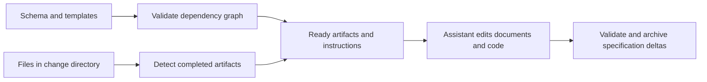

# OpenSpec: artifact graphs and safe specification maintenance

Repository: https://github.com/Fission-AI/OpenSpec
Inspected revision: `79b6aa9c98f1e36795b2bc4ef2a8f770c6d3a777` (main, committed 2026-09-25).
Reviewed: 2026-09-27, Europe/Sofia.
Method: source and test inspection; no installation or execution.
License declaration: MIT; Node `>=20.19.0`, pnpm `10.34.5`, package version `1.13.2` at this source revision. [Package manifest][package]

## Architectural role

OpenSpec is adjacent specification tooling. Brokkr's checked-in realm already selects the `openspec` dialect. Its graph is a dependency graph of documents: schema definitions name artifacts, output paths, templates and prerequisites; filesystem observations determine which artifacts exist; commands derive ready/blocked artifacts and generate instructions for an assistant. It does not supply a general agent-effect scheduler or Brokkr's delivery journal. That distinction preserves the useful comparison without treating existing tooling as a replacement engine. [Graph][graph], [state detection][state], [workflow documentation][opsx]

## Graph semantics and validation

The graph implementation uses Kahn's algorithm for topological order and declaration order for ties. This is an explicit deterministic authoring rule: equally ready artifacts follow the order chosen by the schema author. Separate methods return ready artifacts, unresolved dependencies and completion. Tests exercise linear and diamond dependencies, independent roots, and a waiting artifact whose declaration precedes a newly queued root. These tests are more informative than the presence of a graph visualization. [Implementation][graph], [graph tests][graph-tests]

Schema loading parses YAML into Zod types, rejects duplicate identifiers, unknown dependency references and cycles, and also validates `apply.requires`. The latter is a concrete lesson in consistent validation: an unknown apply prerequisite previously could disappear from the effective gate, so it is now rejected at load time. An `apply.tracks` mismatch is intentionally a warning because that field is a path rather than an artifact identifier. Preserving that distinction avoids breaking valid custom workflows. [Schema validation][schema]

The schema limits an artifact list to 1,000 entries, explicitly to bound recursive cycle validation. Relative path fields reject absolute paths, drive-qualified paths, `..` segments and NUL bytes. Output resolution additionally checks containment and deals with glob/symlink traversal. This offers examples for Brokkr's policy-validation and resource-bound work: bound the parser/validator itself, and test paths after resolution as well as before it. It does not establish arbitrary process sandboxing. [Types and limits][types], [output resolution][outputs]

An artifact being “complete” means its output exists. `detectCompleted` calls the output existence helper; it does not prove the document is correct, its requirements are satisfied, or an independent reviewer approved it. The state tests deliberately assert file/glob existence semantics. A Brokkr integration must keep “ready to proceed with authoring” distinct from “delivery evidence accepted.” [State implementation][state], [state tests][state-tests]

## Effects, recovery and security boundaries

OpenSpec's most interesting effect handling is specification archive/merge. The archive implementation builds and validates proposed spec changes before writing, checks that distinct mutations do not resolve to the same target, captures snapshots, and attempts rollback when later operations fail. Rollback checks current contents and refuses to overwrite concurrent changes. Directory moves use rename where possible, with more elaborate copy/claim handling for platforms where rename fails. This is substantive file-integrity work, not merely a prompt that says to archive safely. [Archive implementation][archive]

These operations do not establish a transactional event journal spanning every changed file. Error handling can report both the original failure and rollback failures; the inspected implementation makes this visible instead of claiming every failure restores the initial state. Crash/power-loss atomicity, durability across filesystems and safe coordination with arbitrary external writers were not established by this review. The archive module and its test file are also large; their size is an observable maintenance surface, not by itself proof of low quality. [Archive rollback][archive]

Archive supports explicit validation/spec-update bypass options. Such options fit operator-directed document maintenance; they should not be mistaken for an unavoidable security or review gate. The inspected tooling does not own model-process lifetimes, network egress or provider credentials in the way a delivery executor would need to. Those controls belong to the assistant host and any integrating engine. [Archive options][archive], [workflow model][opsx]

## Setup, tests and maintenance

The package exposes a CLI and library exports; its manifest pins a package-manager version and declares the minimum Node version. CI installs from the frozen lockfile and tests Linux, macOS and Windows, with pinned action revisions. This is stronger evidence of intended portability and reproducible dependency resolution than a README badge, but we did not execute the matrix or establish current release health. [Package][package], [CI][ci]

The reviewed tests cover schema rejection, deterministic ordering, file/glob completion, archive validation and concurrent-change-sensitive rollback. The archive tests include destination collisions during merge, nonterminal prompts, preserving rerun flags and genuine invalid requirement deltas. Test inspection establishes that these cases have assertions; it does not prove the tests passed at this revision. [Graph tests][graph-tests], [archive tests][archive-tests]

## Brokkr lessons and experiments

- Keep the existing dialect integration. Study OpenSpec for graph-authoring diagnostics and document maintenance; compare delivery authority against executors separately.
- Apply the same vocabulary/reference checks across every policy entry point. The `apply.requires` fix illustrates why validating only the most obvious dependency field is insufficient.
- Report resource limits and their reason at schema load time. Exercise a near-limit dependency chain and a rejected over-limit chain as part of Brokkr #429/#433 qualification.
- Borrow the testing pattern for “rollback refuses to overwrite a concurrent edit,” while retaining Brokkr's own journal/restore contract in #431.
- In a controlled fixture, create empty artifact files and verify that OpenSpec reports authoring completion while Brokkr still refuses absent execution/review evidence. This compares semantics rather than attempting to make the tools interchangeable.

## Evidence ledger

Established by inspected code: artifact dependency validation, deterministic tie-breaking, existence-derived completion, relative-path constraints, archive prevalidation and guarded rollback. Declared by configuration: runtime baseline, packaging, supported CI hosts. Unestablished: whole-run effect isolation, universal crash atomicity, independent outcomes, and guarantees of the assistant that consumes generated instructions.

[package]: https://github.com/Fission-AI/OpenSpec/blob/79b6aa9c98f1e36795b2bc4ef2a8f770c6d3a777/package.json
[graph]: https://github.com/Fission-AI/OpenSpec/blob/79b6aa9c98f1e36795b2bc4ef2a8f770c6d3a777/src/core/artifact-graph/graph.ts
[graph-tests]: https://github.com/Fission-AI/OpenSpec/blob/79b6aa9c98f1e36795b2bc4ef2a8f770c6d3a777/test/core/artifact-graph/graph.test.ts
[schema]: https://github.com/Fission-AI/OpenSpec/blob/79b6aa9c98f1e36795b2bc4ef2a8f770c6d3a777/src/core/artifact-graph/schema.ts
[types]: https://github.com/Fission-AI/OpenSpec/blob/79b6aa9c98f1e36795b2bc4ef2a8f770c6d3a777/src/core/artifact-graph/types.ts
[outputs]: https://github.com/Fission-AI/OpenSpec/blob/79b6aa9c98f1e36795b2bc4ef2a8f770c6d3a777/src/core/artifact-graph/outputs.ts
[state]: https://github.com/Fission-AI/OpenSpec/blob/79b6aa9c98f1e36795b2bc4ef2a8f770c6d3a777/src/core/artifact-graph/state.ts
[state-tests]: https://github.com/Fission-AI/OpenSpec/blob/79b6aa9c98f1e36795b2bc4ef2a8f770c6d3a777/test/core/artifact-graph/state.test.ts
[archive]: https://github.com/Fission-AI/OpenSpec/blob/79b6aa9c98f1e36795b2bc4ef2a8f770c6d3a777/src/core/archive.ts
[archive-tests]: https://github.com/Fission-AI/OpenSpec/blob/79b6aa9c98f1e36795b2bc4ef2a8f770c6d3a777/test/core/archive.test.ts
[opsx]: https://github.com/Fission-AI/OpenSpec/blob/79b6aa9c98f1e36795b2bc4ef2a8f770c6d3a777/docs/opsx.md
[ci]: https://github.com/Fission-AI/OpenSpec/blob/79b6aa9c98f1e36795b2bc4ef2a8f770c6d3a777/.github/workflows/ci.yml
