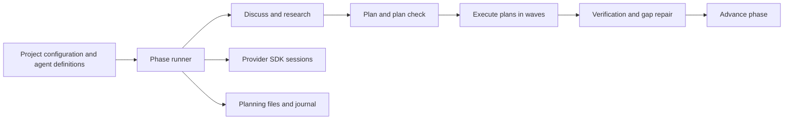

# GSD: delivery SDK beneath the prompting workflow

Repository: https://github.com/gsd-build/get-shit-done
Inspected revision: `bdcaab2c752d9a33a1a1ca9acf3a3c81fb991815` (main, committed 2026-05-31).
Reviewed: 2026-09-27, Europe/Sofia.
Method: source and test inspection; no installation or execution.
License declaration: MIT. Package `1.50.0-canary.0`; Node `>=22.0.0`. [Package][package]

## Repository identity and scope

GitHub reported this repository archived at inspection time. Its pinned README explicitly redirects development to `open-gsd/gsd-core`. The successor was separately checked through GitHub metadata and was unarchived, with default branch `next`; its implementation was not reviewed here. The conclusions below describe the archived revision, not current GSD Core. This corrects the first survey's uncertainty about whether an identifiable successor exists. [Archived repository README][readme], [successor repository](https://github.com/open-gsd/gsd-core)

The archived tree contains more than assistant-interpreted workflow documents. Alongside commands, specialist agent Markdown and hooks, it has a TypeScript SDK with session execution, a coded phase runner, transport policies, verification outcomes and a planning journal. Treating the project as purely prompts would miss a substantial peer to Brokkr's delivery orchestration. Its package installs multiple CLI entry points and ships both source and compiled SDK assets. [Package][package], [phase runner][phase]

## Delivery architecture

The phase runner codes the sequence discuss → research → plan → plan-check → execute → verify → advance. It inspects existing artifacts to skip completed preparation and supports configuration flags that disable individual stages. Execution can group plans into parallel waves or fall back to sequential work. Verification has its own gap-closure cycle and operator callbacks. Advance can be vetoed by an operator callback, but absence of that callback or a callback exception auto-approves advancement even when `auto_advance` is false. These are real control-flow mechanisms with tests, not merely lifecycle labels in a role prompt. [Runner][phase], [runner tests][phase-tests]

The important qualification is that verification is configurable. When `config.workflow.verifier` is false, no verify step is added; the subsequent `steps.every(...)` test considers the absent verify step satisfied and permits advance if the runner has not halted. Tests explicitly cover disabled verification and a configuration where only plan, execute and advance remain. With verification enabled, tests cover missing status, human-review outcomes and unresolved placeholders. Brokkr's protected review is a different policy choice, so a meaningful comparison must align the configured contract first. [Advance logic][phase], [tests][phase-tests]

`retryOnce` retries a failed step unless its error belongs to the special verification outcome vocabulary. This is bounded retry, but it does not establish that prior external effects are safe to repeat. The inspected helper has no “effect may have committed” state. A provider failure after a write therefore needs a separate uncertain-effect experiment, rather than inferring safe replay from a retry limit. [Retry implementation][phase]

## Agents, permissions and budgets

Session creation derives tools from an agent definition or defaults, resolves a model and constructs a prompt. The plan session passes a default 50-turn cap and USD 5 budget to the underlying Claude Agent SDK. These are concrete integration settings; their runtime enforcement ultimately depends on that SDK, and the source review did not validate spend accounting under interruption. [Session runner][session]

The same call explicitly selects `permissionMode: 'bypassPermissions'`, sets `allowDangerouslySkipPermissions: true`, and loads project settings. Tool lists and role prompts therefore should not be described as an operating-system sandbox or a guarantee that all writes receive user confirmation. This is a source-visible trust choice of the inspected execution path, not a claim that every GSD host uses identical settings. [Session configuration][session]

The workflow guard hook is advisory: it detects edits outside an active GSD workflow, optionally emits a warning, and exits successfully. It is disabled by default, and malformed input/configuration paths also exit without blocking. That is useful guidance for a cooperative assistant but cannot enforce an unavoidable delivery policy. [Hook][guard]

## Journal, recovery and process lifecycle

`PlanningJournal` writes JSONL events with source sequence, actor, authority, causation, evidence identifiers and an idempotency key. Before appending it searches existing events; the same key and request hash returns the old event, while a conflicting hash throws. This is a useful concrete idempotency contract. The hash covers a selected request projection; it is not a predecessor hash binding the whole event chain. [Journal][journal]

The append path performs read/search/read/append without an interprocess lock or transactional compare-and-append. Two writers can therefore race in the inspected implementation; that is a source-derived risk, not a reproduced incident. Read errors are caught and returned as an empty journal, while malformed JSON throws during parsing. Compaction writes a fixed temporary path and renames it over the journal; it does not establish safe concurrent compaction or fsync durability. The reviewed tests assert monotonic sequencing, duplicate-key replay and JSONL output, not a crash/concurrency qualification. [Journal implementation][journal], [tests][journal-tests]

The query subprocess adapter uses `execFile` with a timeout and 10 MiB captured subprocess-output limit, preserving an argument vector instead of constructing a shell string. It distinguishes timeout, spawn, execution and parse failures. It inherits the process environment and can read JSON through an `@file:` output indirection. That indirection reads the whole referenced file without an explicit size limit, so the parsed result is not universally bounded. The inspected adapter does not implement a full descendant-process settlement protocol; it also runs helper queries rather than proving lifecycle behavior of all provider sessions. [Subprocess adapter][subprocess]

## Setup and maintenance evidence

The package has separate unit, integration, installation, security and slow suites, a coverage command, SDK builds, generated-projection freshness checks and skill-dependency linting. Those scripts show substantial investment in maintaining a multi-surface product. They also show real setup complexity: Node 22, an SDK build, compiled assets, host-specific installation, hooks and several schema/projection surfaces. We inspected these declarations and selected tests; we did not run them or establish release correctness. [Package manifest][package]

## Brokkr lessons and controlled comparisons

1. Include GSD's SDK in delivery comparisons. The first-pass “screened only” description was insufficient to judge its architecture.
2. Compare enabled-policy configurations: demonstrate what happens with verifier disabled, missing verification status and a human-needed outcome. Brokkr should retain evidence that its protected review cannot disappear through such configuration.
3. Carry a source-visible distinction between advisory hooks, host permissions, tool configuration and effect isolation. A successful warning hook is not a refusal.
4. Test concurrent identical journal requests, conflicting idempotency keys, read permission failure and process death between effect and acknowledgement. These connect to Brokkr #431/#434/#435 without claiming the same storage design.
5. Study the dedicated transport/error vocabulary and generated-surface freshness checks as maintenance techniques. Adoption requires a scoped proposal, not copying the SDK.

## Evidence ledger

Established: coded phase progression, configurable verification, bounded retry helper, provider-session options, request-level journal idempotency, bounded captured subprocess output and typed error construction. Source-derived limitations: advisory workflow enforcement, no transactional append in the inspected journal, and no effect-safety proof from retry alone. Unestablished: successor behavior, crash recovery under load, host isolation, independent delivery outcomes, and current package behavior outside this pinned canary source tree.

[readme]: https://github.com/gsd-build/get-shit-done/blob/bdcaab2c752d9a33a1a1ca9acf3a3c81fb991815/README.md
[package]: https://github.com/gsd-build/get-shit-done/blob/bdcaab2c752d9a33a1a1ca9acf3a3c81fb991815/package.json
[phase]: https://github.com/gsd-build/get-shit-done/blob/bdcaab2c752d9a33a1a1ca9acf3a3c81fb991815/sdk/src/phase-runner.ts
[phase-tests]: https://github.com/gsd-build/get-shit-done/blob/bdcaab2c752d9a33a1a1ca9acf3a3c81fb991815/sdk/src/phase-runner.test.ts
[session]: https://github.com/gsd-build/get-shit-done/blob/bdcaab2c752d9a33a1a1ca9acf3a3c81fb991815/sdk/src/session-runner.ts
[guard]: https://github.com/gsd-build/get-shit-done/blob/bdcaab2c752d9a33a1a1ca9acf3a3c81fb991815/hooks/gsd-workflow-guard.js
[journal]: https://github.com/gsd-build/get-shit-done/blob/bdcaab2c752d9a33a1a1ca9acf3a3c81fb991815/sdk/src/planning-journal.ts
[journal-tests]: https://github.com/gsd-build/get-shit-done/blob/bdcaab2c752d9a33a1a1ca9acf3a3c81fb991815/sdk/src/planning-journal.test.ts
[subprocess]: https://github.com/gsd-build/get-shit-done/blob/bdcaab2c752d9a33a1a1ca9acf3a3c81fb991815/sdk/src/query-subprocess-adapter.ts
