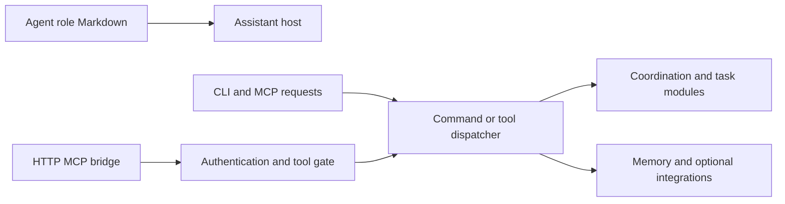

# Ruflo: broad orchestration surfaces with path-specific guarantees

Repository: https://github.com/ruvnet/ruflo
Inspected revision: `a91db6768ba5e8c9e31c840ad25c1c96478f3f0f` (main, committed 2026-09-26).
Reviewed: 2026-09-27, Europe/Sofia.
Method: targeted source/test/configuration inspection; no installation, execution or exploit attempt.
License declaration: MIT. Root package identifies as `claude-flow` version `3.45.0`, Node `>=20.0.0`. The rename and multiple package versions matter when identifying the installed product. [Package][package]

## Scope and architecture

Ruflo combines specialist agent prompts, CLI packages, MCP tools, coordination modules, memory services and optional integrations. Its root CLI loads the nested v3 CLI entry point; the package includes selected built assets and dependencies rather than every module in the source tree. The reviewed modules below must therefore be identified individually. Finding an event store or security module does not establish that every command, plugin or HTTP deployment uses it. [CLI entry][entry], [package layout][package]

The coder definition has ordinary Markdown/frontmatter identity and instructions to read specifications and architectural decisions. It assigns precedence between those documents and tells the agent to surface conflicts. This is charter-like authoring, but the text is interpreted by the assistant; it is not itself a compiled authority graph or an immutable permission grant. A comparison should separately inspect the dispatcher that executes a resulting tool request. [Coder role][coder]

## Task graph and failure semantics

The inspected `TaskOrchestrator` keeps task and dependency maps, explicit task states, an agent registry and an event bus. Assignment requires the task to be queued and unblocked; starting requires assigned state; completion requires in-progress state. Adding a dependency checks for a cycle and verifies both tasks exist. These are concrete deterministic guards in the module. [Task orchestrator][tasks]

Creation and later dependency mutation are not equivalent validation paths. `createTask` accepts the provided dependency identifiers directly. `getBlockingTasks` only returns dependencies that resolve to an existing task and are incomplete. Consequently an unknown identifier supplied on creation does not block in this implementation, whereas adding an unknown dependency later throws. This is a source-derived counterexample to a blanket “dependencies validated” claim; it was not reproduced through a packaged CLI, whose preceding validation was not established here. [Creation and blocking][tasks]

Failure increments a counter, requeues before the third failure, then marks failed. Cancellation changes task/agent state; the inspected method does not itself kill or drain a worker process. The module supplies neither proof that external effects are safe to retry nor a whole-tree process settlement guarantee. Those are separate obligations of the invoking worker/runtime. Brokkr should apply the same scrutiny to each effect path rather than treating a policy transition as process cleanup. [Failure and cancellation][tasks]

## Persistence and checkpoints

The shared `EventStore` is based on sql.js: it loads an SQLite image into memory, inserts parameterized event rows, tracks versions per aggregate and supports replay/snapshots. It exports the database image through `writeFileSync` on persistence, with configurable periodic persistence and a final persist on close. A successful in-memory append therefore does not demonstrate a durable per-event disk transaction. The inspected persistence method does not use an atomic replacement or fsync protocol; cross-process fencing and a cryptographic predecessor chain were not established in this module. [Event store][events]

This distinction is especially important when comparing “SQLite” across projects. Brokkr's journal contract concerns append transactions, hash integrity and folding recorded events; a WASM database periodically exported to a file has a different acknowledgement/durability boundary. The event-store tests exercise ordinary operations and persistence, but reading them is not evidence that crash and competing-writer behavior was qualified. Other Ruflo storage paths may differ and were not generalized from this one. [Store tests][event-tests]

`CheckpointGate` is an optional memory rollback facility around a callback. Its documented and implemented degradation policy runs the callback without a checkpoint when the dependency is absent, a kill switch is set, or no memory path is configured. The return object records `degraded`, `checkpointed` and `rolledBack`. This transparency is useful; calling it an unavoidable rollback guarantee would be wrong. Rolling back an `.rvf` memory file also cannot undo an email, a remote write or an external process effect. [Gate implementation][checkpoint], [gate tests][checkpoint-tests]

## Security: inspect the exposed path

The maintainers published advisory GHSA-c4hm-4h84-2cf3 for unauthenticated execution through the Docker MCP bridge, affecting versions before `3.16.3` and declaring `3.16.3` patched. This is a historical, disclosed issue, not a newly reproduced vulnerability or a claim that the inspected head remains affected. [Maintainer advisory](https://github.com/ruvnet/ruflo/security/advisories/GHSA-c4hm-4h84-2cf3)

At the inspected revision, the bridge refuses a public bind without an authentication token; configured bearer authentication uses a constant-time comparison; and the shared `executeTool` path disables terminal execution unless explicitly enabled. Runtime regression tests start the bridge and assert unauthenticated rejection, authenticated access, terminal denial and failure to bind publicly without a token. A dedicated workflow runs static and runtime security checks. This is much stronger evidence than counting a separate `SafeExecutor` module, although it still does not establish complete security of all bridge tools and alternate deployments. [Bridge][bridge], [runtime tests][bridge-tests], [security workflow][security-ci]

The lesson is the placement of enforcement. A protection applied only in one high-level automation path can leave another direct tool endpoint outside it. Brokkr's grants (which pre-approve tools and remove none), its engine-held effects and its dispatcher work should test every externally reachable path, including replay and retry, rather than merely asserting a validator exists. No public vulnerability report or external contact was made during this inspection.

## Setup and maintainability

The root manifest declares many direct, optional, overridden and bundled dependencies. Some convenience scripts (`build:ts`, `lint`) end with `|| true`; their successful exit alone is not a quality gate. Conversely the inspected prepublish script explicitly checks failures while building required internal packages and staging runtime bundles. The correct conclusion is path-specific: publishing has stronger refusal behavior than those convenience commands. Source module behavior still needs a package-artifact parity check before making claims about an installed release. [Manifest][package], [publish preparation][publish]

## Brokkr lessons and experiments

- Compare a concrete deployed path and package revision, not the combined feature list of a large repository.
- Test dependency validation through task creation and mutation separately; mirror the principle in Brokkr #429.
- Treat `degraded` as a surfaced policy decision. For mandatory evidence, refuse or park when persistence is unavailable; do not silently inherit an optional memory-cache policy.
- Kill the process immediately after append acknowledgement and compare recovered events. Include competing writers and interrupted database export in a controlled persistence experiment.
- Test every dispatcher entry against the same denied effect. The historical advisory and its regression tests provide a useful enforcement-placement case study.
- Separate source build, packed artifact and installed-runtime checks in setup qualification (#438).

## Evidence ledger

Established in selected modules: task-state guards, later dependency cycle checks, bounded retry count, in-memory SQL event storage, explicit checkpoint degradation, bridge authentication/tool refusals and corresponding test assertions. Unestablished: universal wiring of those modules, durability of every acknowledged event, lifecycle settlement, external-effect rollback, installed artifact equivalence and claimed production performance. None of the inspected tests or third-party programs was executed.

[package]: https://github.com/ruvnet/ruflo/blob/a91db6768ba5e8c9e31c840ad25c1c96478f3f0f/package.json
[entry]: https://github.com/ruvnet/ruflo/blob/a91db6768ba5e8c9e31c840ad25c1c96478f3f0f/bin/cli.js
[coder]: https://github.com/ruvnet/ruflo/blob/a91db6768ba5e8c9e31c840ad25c1c96478f3f0f/.claude/agents/core/coder.md
[tasks]: https://github.com/ruvnet/ruflo/blob/a91db6768ba5e8c9e31c840ad25c1c96478f3f0f/v3/@claude-flow/swarm/src/coordination/task-orchestrator.ts
[events]: https://github.com/ruvnet/ruflo/blob/a91db6768ba5e8c9e31c840ad25c1c96478f3f0f/v3/@claude-flow/shared/src/events/event-store.ts
[event-tests]: https://github.com/ruvnet/ruflo/blob/a91db6768ba5e8c9e31c840ad25c1c96478f3f0f/v3/@claude-flow/shared/src/events/event-store.test.ts
[checkpoint]: https://github.com/ruvnet/ruflo/blob/a91db6768ba5e8c9e31c840ad25c1c96478f3f0f/v3/@claude-flow/cli/src/services/checkpoint-gate.ts
[checkpoint-tests]: https://github.com/ruvnet/ruflo/blob/a91db6768ba5e8c9e31c840ad25c1c96478f3f0f/v3/@claude-flow/cli/__tests__/checkpoint-gate.test.ts
[bridge]: https://github.com/ruvnet/ruflo/blob/a91db6768ba5e8c9e31c840ad25c1c96478f3f0f/ruflo/src/mcp-bridge/index.js
[bridge-tests]: https://github.com/ruvnet/ruflo/blob/a91db6768ba5e8c9e31c840ad25c1c96478f3f0f/ruflo/src/mcp-bridge/test-runtime-security.mjs
[security-ci]: https://github.com/ruvnet/ruflo/blob/a91db6768ba5e8c9e31c840ad25c1c96478f3f0f/.github/workflows/adr-166-mcp-bridge-security.yml
[publish]: https://github.com/ruvnet/ruflo/blob/a91db6768ba5e8c9e31c840ad25c1c96478f3f0f/scripts/prepare-root-publish.mjs
